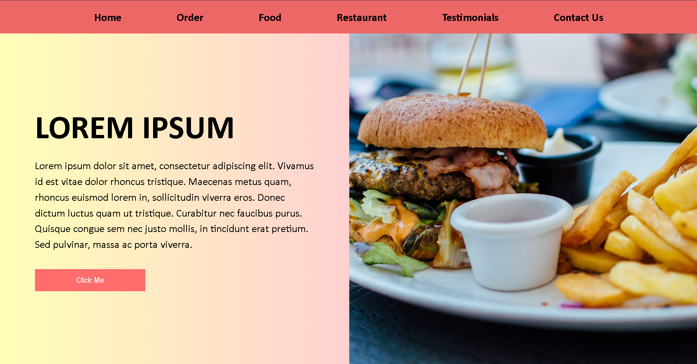
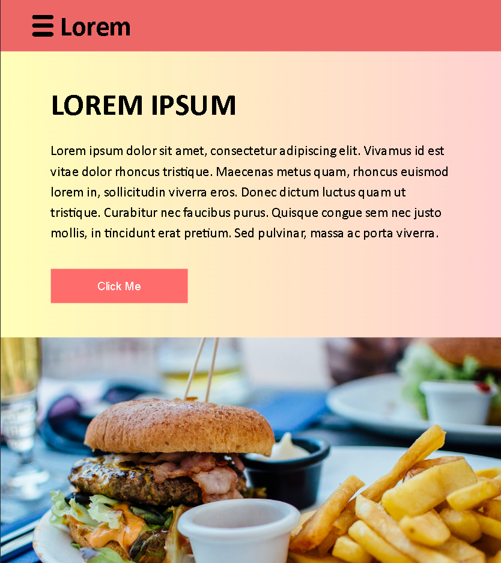
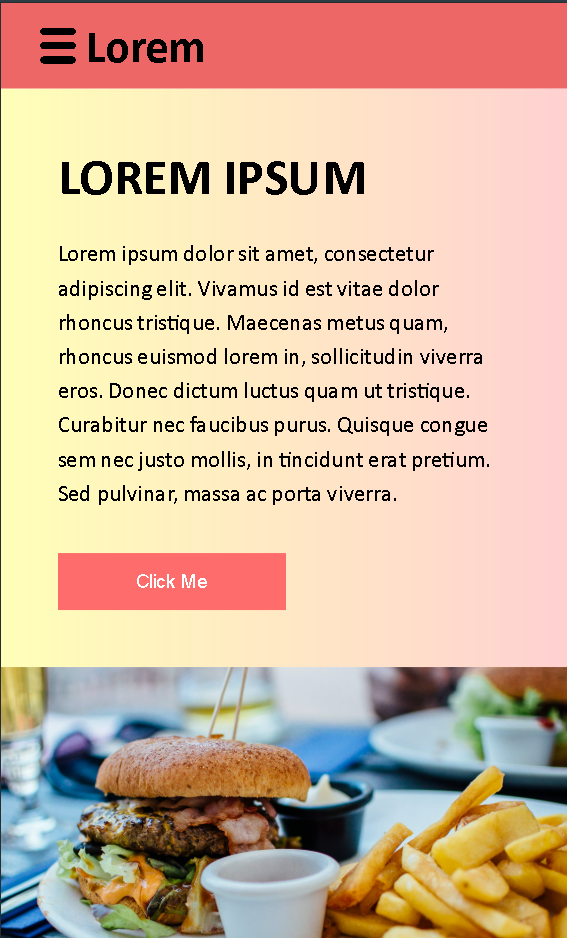

# 🍔 Food Landing Page

A responsive food landing page built using **plain HTML and CSS**, designed to work smoothly across **desktop, tablet, and mobile** devices.  
This project was developed as part of a **Front End Developer assignment**, strictly without using any external libraries or frameworks.

---

## 📸 Preview

### Desktop View

### Tablet View

### Mobile View

> 📌 *All images are responsive and adapt correctly on screen resize and zoom.*

---

## ✨ Features

- Fully responsive layout (Desktop / Tablet / Mobile)
- CSS-only hamburger menu (no JavaScript)
- Clean and modern UI
- Flexible layout using Flexbox
- Images scale without distortion
- No overflow or layout breaking on resize
- Cross-browser compatible

---

## 🛠 Tech Stack

- **HTML5**
- **CSS3**
- Flexbox
- Media Queries

> ❌ No Bootstrap  
> ❌ No Material UI  
> ❌ No JavaScript frameworks  

---

## 📂 Folder Structure

food-landing-page/
│
├── index.html
├── index.css
├── Images/
│ ├── menu-bar.png
│ ├── newimage.png
│ └── ...
│
├── screenshots/
│ ├── desktop.png
│ ├── tablet.png
│ └── mobile.png
│
└── README.md

yaml
Copy code

---

## 🚀 Live Demo

🔗 **Live Site:** https://chandu1108.github.io/restaurant-ui/

---

## 📱 Responsive Design

- **Desktop:** Two-column layout with hero image
- **Tablet:** Adjusted spacing and stacked sections
- **Mobile:**  
  - Hamburger menu  
  - Vertical layout  
  - Touch-friendly UI  

---

## 🧠 What I Learned

- Building responsive layouts without frameworks
- CSS-only dropdown menu using checkbox toggle
- Managing overflow and viewport units correctly
- Writing clean, maintainable CSS
- Debugging real-world layout issues

---

## 📌 Assignment Notes

- Design matches the given reference
- Color scheme closely follows the provided mockup
- Layout does not break on zoom or resize
- Images are not stretched or pixelated
- Text does not overflow

---

## 👤 Author

**Chandan Kumar M**

- GitHub: https://github.com/chandu1108
- LinkedIn: https://www.linkedin.com/in/chandan-kumar-m-a88722242/

---

⭐ *If you like this project, feel free to star the repository!*
